# Polaris Workshop

## Introduction to Polaris and the Style Guide

### What is Polaris?

* Shopify’s design system, provides a common framework with which to build high quality experiences for merchants and partners
* Consists of UI design and development kits, design and content guidelines and more

### How should you use it?

* Style guide
* Guidelines
* Component reference
* What’s new
* Examples

### Workshop overview

Together we will be building out a product review app which allows merchants to receive and manage customer submitted reviews on their products.

#### Goals

Give a high level view of what Polaris (both the components and our documentation) can give you and an overview of the process of building an app using those tools.

#### Structure

We chose to rebuild this app using Polaris React components for this workshop because it is an excellent example of the common patterns you will come across when building out an app for Shopify merchants. It's got an index page, a show page, and a settings page.

By the end of this workshop you will have built something that looks like this.

**Index page**
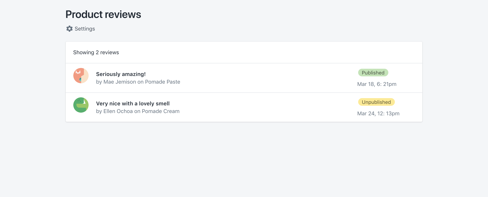

**Show page**
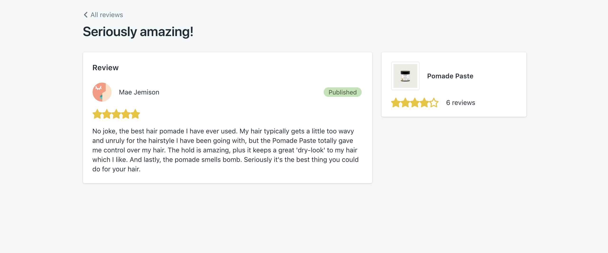

**Settings page**
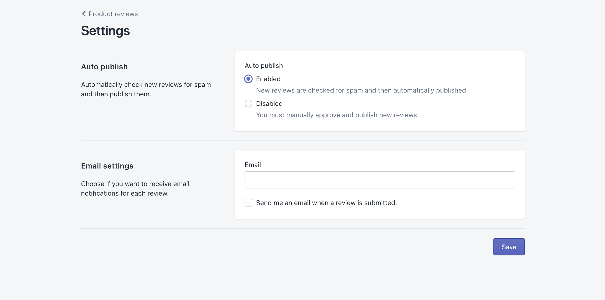

[Live demo](https://polaris-product-reviews.glitch.me/)


## Step 1: Setting up your app

`git clone -b devdegree git@github.com:Shopify/product-reviews-polaris-example.git`

Now change into the new directory we just cloned

`cd product-reviews-polaris-example`

Open up the project in your code editor.

We will then need to install the app dependencies with npm.

`npm install`

Now we can run our app with:

`npm start`

Your app should be running at [http://localhost:3000](http://localhost:3000) and you should see a page that looks like this:

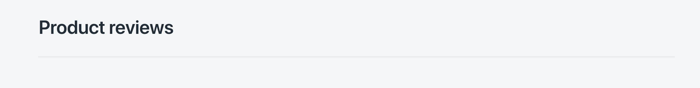

We have already set up the structure of the app for you. We have included a simple GraphQL server with some dummy data, the React Apollo client to connect the React components with that GraphQL server, and React Router with four routes started for you.

Looking at the folder structure, there is a lot in here but the most important parts we will be using today are:

* `src/App.js` - This is the file for the top level app component. This is where we initialize the React Apollo client, setup React Router and its routes, and include the `AppProvider` component from Polaris.
* `src/routes/` - This is the folder where you will see the four routes we have setup for you. A review list route, a review details route, a settings route, and the not found route for 404 errors.
* `src/components/` - This is the folder where we have the custom components we have built for our app. There are two components in here. A `Rating` component used to show the number of stars a review has, and a `ReviewListItem` component which we will be using to build out our resource list on the index page.

Now let's walk through how to create the index page of reviews.

## Step 2: Review index

Go ahead and open up the review list file located at `src/routes/ReviewList.js`. If you scroll to the bottom of the file, you will see we have a GraphQL query set up to fetch the list of reviews.

```jsx
export default graphql(gql`
  query ReviewsQuery {
    reviews {
      id
      title
      status
      date
      customer {
        name
      }
      product {
        name
      }
    }
  }
`)(ReviewList);
```

This injects a `data` prop into our `ReviewList` component that gives us an array of `reviews` and a `loading` boolean that tells us whether or not we're still fetching the reviews.

Let's walk through how we've built out the UI of this page using the Polaris React component library.

### Page

When building a Shopify app with Polaris React, every view should start with a [Page](https://polaris.shopify.com/components/structure/page) component. All of the view's content will then nest inside of the page.

Below our dependency imports in `ReviewList.js`, you'll notice we've imported the `Page` component from Shopify Polaris along with a few other Polaris components.

```jsx
import React from 'react';
import {graphql} from 'react-apollo';
import gql from 'graphql-tag';

import {
  Page,
  EmptyState,
  Card,
  ResourceList,
  SkeletonBodyText,
  SkeletonDisplayText,
  TextContainer,
} from '@shopify/polaris';
```

So far, our page looks like this:


We want to add an action that will link to the settings page we've built, so that our page looks something like this:

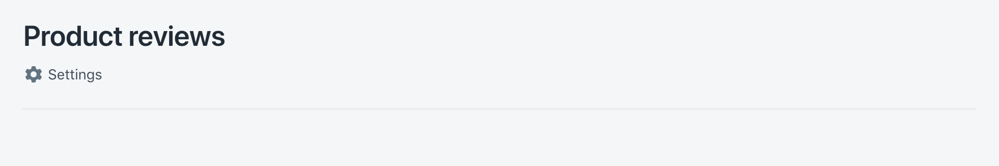

We've already imported the gear shaped SVG included in this project:

```jsx
import {settings} from '../icons';
```

Then we've got a functional React component named `ReviewList` that returns the page.

```jsx
function ReviewList({data: {loading, reviews}}) {
  /* Content logic... */
  return <Page title="Product reviews">{/* Page content... */}</Page>;
}
```

The page component requires a `title` prop, which accepts a `string` to give the page a title. We've given it the title "Product reviews".

There are a number of optional props the page component accepts as well. One of those optional props is a list of secondary actions. Let's head over to the [style guide](https://polaris.shopify.com/components/structure/page) to find out what the `secondaryActions` prop accepts as a value.

Add a `secondaryActions` prop to the page component. Since it it accepts a `SecondaryAction[]`, give it an array with a single object. This array will map to a settings button below our page title. As you can see in the style guide prop explorer (which opens when you click on the `secondaryActions` prop), secondary action objects can have a lot of different properties. We will only give our settings action an icon, content, and url. We'll use that gear shaped SVG as the icon property of our secondary action.

```jsx
<Page
  title="Product reviews"
  secondaryActions={[{icon: settings, content: 'Settings', url: '/settings'}]}
>
  {/* Page content... */}
</Page>
```

### Card

Now let's dig into the content of our page. When building a new view for your application you should always consider the different states your page will have based on the availability and quantity of the data being presented: loading, empty, some, and many.

#### Loading state

We start with the loading state content. This is what is shown while the network request fetches the review data through GraphQL.

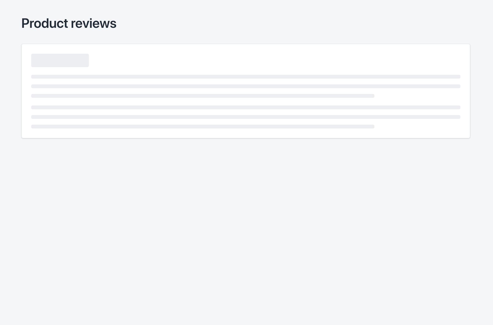

We hold the content of our loading state in a variable that uses the `loading` property of the `data` prop to determine whether or not we should show this content.

We wrap the loading state content with a card component. Cards are used to group similar concepts and tasks together to make Shopify easier for merchants to scan, read, and get things done.

```jsx
const loadingStatePageContent = loading ? (
  <Card sectioned>
    <TextContainer>{/* Skeleton components... */}</TextContainer>
  </Card>
) : null;
```

Polaris comes with a set of skeleton content components that can be used to communicate to the merchant that data is currently being fetched. Look back at the import statement for Polaris components to determine which skeleton components we've imported.

Let's go back to the [style guide](https://polaris.shopify.com) to take a look at those components:
* Use the search bar (top right) to find the style guides for the skeleton components we've imported.

* Once you get to a skeleton component style guide, look at the different examples provided by selecting from the example menu at the top of the page.

* Explore the props list and use it to play with the component code in the playground.

    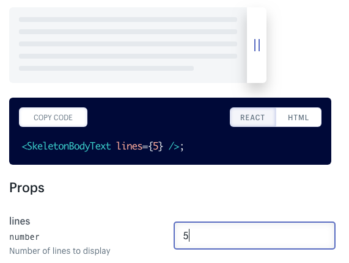

* Paste some skeleton content from the component playground into the text container of our loading state content:
    ```jsx
const loadingStatePageContent = loading ? (
  <Card sectioned>
    <TextContainer>
      <SkeletonDisplayText size="small" />
      <SkeletonBodyText />
      <SkeletonBodyText />
    </TextContainer>
  </Card>
) : null;
```

The loading state content is already a child of our page. We can see what our loading state looks like by uncommenting the two lines of code below line 18.

```jsx
/* Comment or uncomment the next two lines to toggle the loading state */
loading = true;
reviews = null;
```

### Empty state

Next, let's go over how to build out our page's empty state using the Polaris `EmptyState` component. This is what will be displayed when we aren't still loading data but there are no reviews for the merchant's products yet.

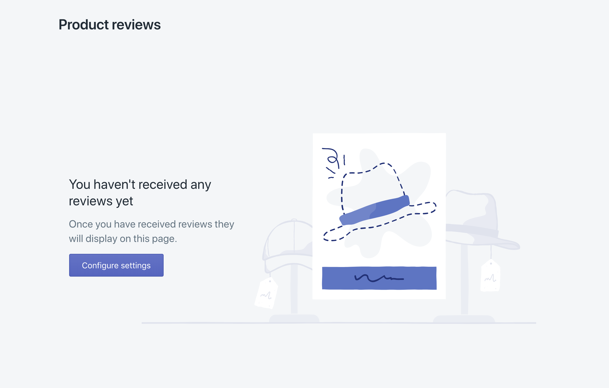

Let's add the empty state component to our Polaris component import.

We store the content of the empty state in a variable called `emptyStateContent`, similar to how we stored our loading state in a variable called `loadingStatePageContent`. We use the length of the `reviews` array that we receive from the GraphQL query to decide whether or not to show the empty state.

```jsx
const emptyStateContent =
  reviews && reviews.length === 0 ? (
    <EmptyState
      heading="You haven't received any reviews yet"
      image="/review-empty-state.svg"
    >
      <p>Once you have received reviews they will display on this page.</p>
    </EmptyState>
  ) : null;
```

We can see what the empty state of our page looks like by commenting back out lines 19 and 20, and uncommenting the code on line 23.

```jsx
/* Comment or uncomment the next two lines to toggle the loading state */
// loading = true;
// reviews = null;

/* Comment or uncomment the next line to toggle the empty state */
reviews = [];
```

Let's look at our page now that we've handled the case of a store without reviews. Uh oh, there's a lot of errors here! When running into errors with Polaris components, a good first step is to double check the style guide to make sure we haven't forgotten any required props.

Looking at the [empty state page of the style guide](https://polaris-v2.shopify.com/components/structure/empty-state), we see the tag `Required` next the `action` prop, which means that adding an `action` prop to the empty state component is **required**. This is because it's a best practice to give merchants a relevant, meaningful next step they can take after reaching an empty page.

Let's add an `action` prop to our empty state component that will link the merchant to the settings page.

```jsx
<EmptyState
  heading="You haven't received any reviews yet"
  action={{content: 'Configure settings', url: '/settings'}}
  image="/review-empty-state.svg"
>
  <p>Once you have received reviews they will display on this page.</p>
</EmptyState>
```

The `content` prop specifies what text to put on the button, and the `url` prop identifies the page to navigate to when the button is pressed.

Now we can see our empty state page!

### Resource list

The last variable we create stores the content of the list of reviews. We use the length of the array of reviews we receive from GraphQL to determine whether or not we render the reviews list. To wrap our reviews list content, we use a `Card` component just like we did for our loading and empty state content.

```jsx
const reviewsIndex =
  reviews && reviews.length > 0 ? (
    <Card>{/* add a ResourceList of reviews here... */}</Card>
  ) : null;
```

To build the list of reviews, we will use the Polaris `ResourceList` component. `ResourceList` displays the key details of a collection of resources (reviews in this case) that allow a merchant to find, select, take bulk action on, or navigate to see more details about each resource.

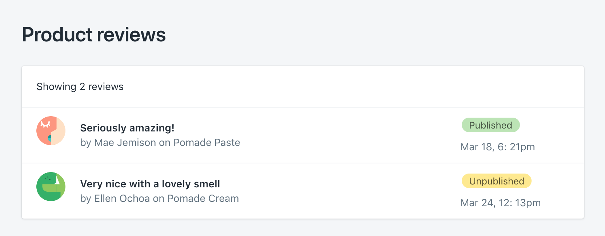

Since every type of resource is different and requires different information to be shown, we allow you to customize the display of each item in the list by using a custom component instead of the `ResourceList.Item` subcomponent. For this app, we created a custom component called `ReviewListItem` and have already imported it into this file:

```jsx
import ReviewListItem from '../components/ReviewListItem';
```

Let's start building our index. First, place a resource list component inside of the card in the `reviewsIndex` variable.

```jsx
const reviewsIndex =
  reviews && reviews.length > 0 ? (
    <Card>
      <ResourceList />
    </Card>
  ) : null;
```

Next, let's go back to the [Polaris style guide](https://polaris.shopify.com) and search for "resource list" so we can explore what props to pass into our resource list.

* The `showHeader` prop is an optional boolean that toggles whether or not a heading with a count of the list items is shown.
* The `resourceName` prop is also optional. It takes an object that specifies the singular and plural names of the resources so the component can use them when referencing the resources in places like the heading. If left blank, the resource list will just default to calling them items.
* The `items` prop is required and takes an array of objects. We pass the resource list our array of review objects here.
* The `renderItem` prop is required as well. It's a callback function used by the resource list to map over and render the list of resources the `items` prop receives. Here is where we will instruct the component to render each review with our custom `ReviewListItem` component.

```jsx
const reviewsIndex =
  reviews && reviews.length > 0 ? (
    <Card>
      <ResourceList
        showHeader
        resourceName={{singular: 'review', plural: 'reviews'}}
        items={reviews}
        renderItem={(review) => <ReviewListItem {...review} />}
      />
    </Card>
  ) : null;
```

The reviews index is the last child of our page component.

```jsx
<Page
  title="Product reviews"
  secondaryActions={[{icon: settings, content: 'Settings', url: '/settings'}]}
>
  {loadingStateContent}
  {emptyStateContent}
  {reviewsIndex}
</Page>
```

Finally, our reviews list view is complete!

We can see what it looks like by commenting back out line 23.

```jsx
/* Comment or uncomment the next line to toggle the empty state */
// reviews = [];
```

<details>
<summary>Click to view the finished ReviewList.js code</summary>

```jsx
import React from 'react';
import {graphql} from 'react-apollo';
import gql from 'graphql-tag';
import {
  Page,
  EmptyState,
  Card,
  ResourceList,
  SkeletonBodyText,
  SkeletonDisplayText,
  TextContainer,
} from '@shopify/polaris';

import ReviewListItem from '../components/ReviewListItem';
import {settings} from '../icons';

function ReviewList({data: {loading, reviews}}) {
  const loadingStateContent = loading ? (
    <Card sectioned>
      <TextContainer>
        <SkeletonDisplayText size="small" />
        <SkeletonBodyText />
        <SkeletonBodyText />
      </TextContainer>
    </Card>
  ) : null;

  const emptyStateContent =
    reviews && reviews.length === 0 ? (
      <EmptyState
        heading="You haven't received any reviews yet"
        action={{content: 'Configure settings', url: '/settings'}}
        image="/review-empty-state.svg"
      >
        <p>Once you have received reviews they will display on this page.</p>
      </EmptyState>
    ) : null;

  const reviewsIndex =
    reviews && reviews.length > 0 ? (
      <Card>
        <ResourceList
          showHeader
          resourceName={{singular: 'review', plural: 'reviews'}}
          items={reviews}
          renderItem={(review) => <ReviewListItem {...review} />}
        />
      </Card>
    ) : null;

  return (
    <Page
      title="Product reviews"
      secondaryActions={[
        {icon: settings, content: 'Settings', url: '/settings'},
      ]}
    >
      {emptyStateContent}
      {loadingStateContent}
      {reviewsIndex}
    </Page>
  );
}

export default graphql(gql`
  query ReviewsQuery {
    reviews {
      id
      title
      status
      date
      customer {
        name
      }
      product {
        name
      }
    }
  }
`)(ReviewList);
```

</details>
<br />

Now let's walk through building out the review detail page that each review in our resource list links to.

## Step 3: Review details

Now that we have our index page working, we will move onto the show page to display the details for each review.

Load the page to see what it currently looks like. You should see something like this:

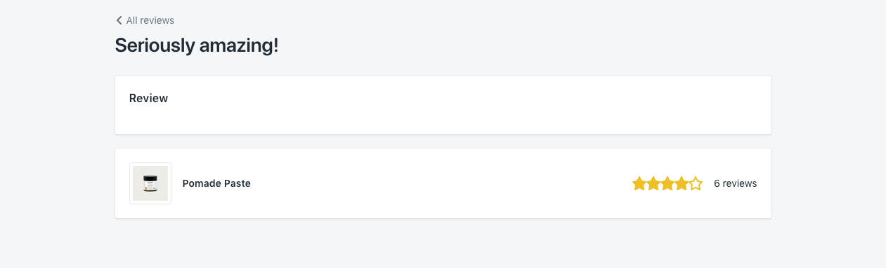

What we want to end up with is something like this:


Go ahead and open up the file `src/routes/ReviewDetails.js` which is where our show page lives.

### Layout

Looking at our mockup for this page we will notice it should display in two columns on larger screens but currently our page is only a single column. We are going to use the `Layout` component from Polaris for this.

To do this, let's open up the style guide and search for "layout".

Use the Examples dropdown to navigate to an example of a two-column layout.

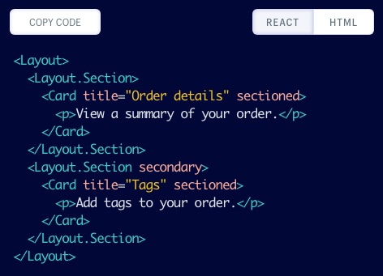

A `Layout` component should go inside a `Page` component, but should wrap (i.e. go outside) `Card` components and their content.

You will notice in the example code that the `Layout` also has a subcomponent for `Section`. This `Section` component takes a `secondary` prop that we will use to mark the second column.

Let's copy that example code and move it into our show page (`ReviewsDetails.js`).

You'll notice that the two-column layout is already implemented for the loading page so we'll only need to implement it for the main review detail page (line 63). Let's go ahead and do that.

You should now have a two-column layout that looks like this:

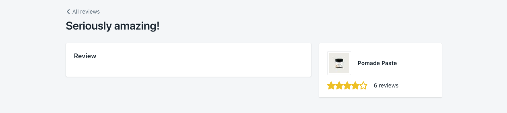


### Stack

So where the `Layout` component works really well for that overall page layout, the `Stack` component is designed for laying out the micro layouts _within_ the card.

`Stack` components can be used to align and space elements in a way that will wrap responsively based on the content size and the space available.

If we uncomment the content within the reviews card (lines 76-80, and you'll need to delete the enclosing braces on lines 75 and 81), we will see it doesn't have any layout right now.

```jsx
<Card title="Review" sectioned>
  {/*
  This is the main content of our review details card.
  We will be introducing a stack component here to lay this content out.*/}

  <Avatar customer name={review.customer.name} />
  <p>{review.customer.name}</p>
  {badge}
  <Rating value={review.rating} />
  <p>{review.content}</p>

</Card>
```
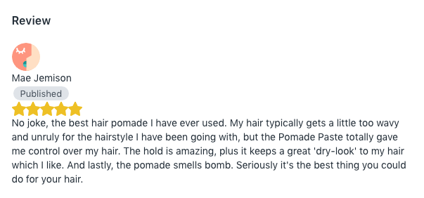

This is a visualization of the layout we want to accomplish.

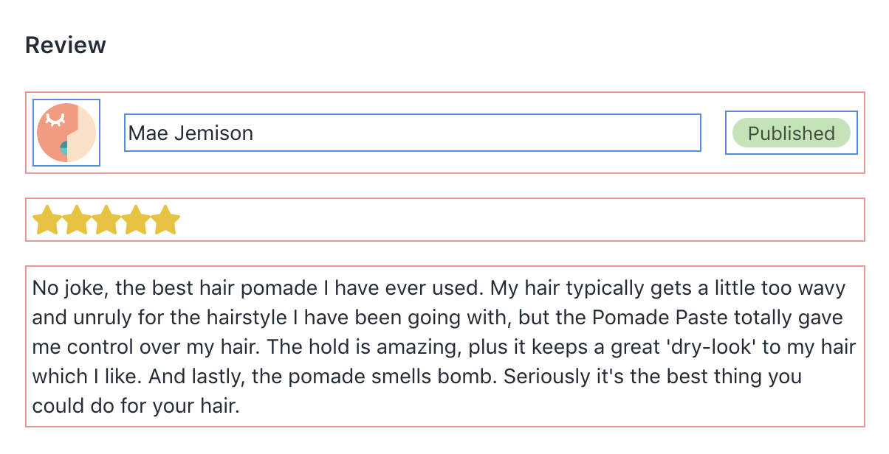

First we will need the vertical `Stack`. Let's go to the style guide and look up the docs to find out how we can do that.

Now we will try wrapping all of that content in the reviews card with our vertical stack. Notice how all of the children now have consistent vertical spacing between them?

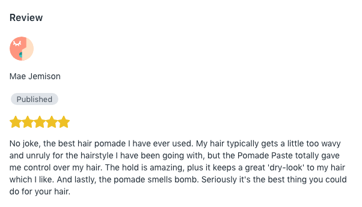

Now we need to get the avatar, customer name and status badge to show inline. We will use a second `Stack` nested inside the first `Stack` to accomplish this. We will want these to be vertically centered so we will look at the `alignment` prop on `Stack`.

```jsx
<Stack alignment="center">
  <Avatar customer name={review.customer.name} />
  <p>{review.customer.name}</p>
  {badge}
</Stack>
```
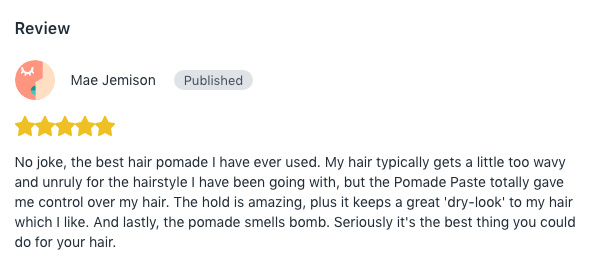

This is starting to look great but you'll notice that the status badge is right up against the customer name and we want it to be pushed to the right side. To do this we're going to use a `Stack.Item` with the `fill` prop around our customer name. This will allow that content to stretch and fill any space that it can.

```jsx
<Stack.Item fill>
  <p>{review.customer.name}</p>
</Stack.Item>
```

Now you'll see the status badge pushed over to the right side of the card where we want it.

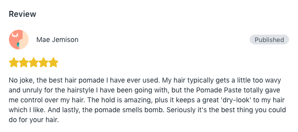

### Badge

Now the badge is in the correct place, but we'll notice the colour still doesn't match our mockup. Let's open up the `Badge` component in the style guide and take a look at how we can do that.

We see that the badge takes a `status` prop. This status can be used to apply a colour to the badge. In our case we want a `success` badge if the review is published and an `attention` status if it is unpublished.

```jsx
const badge =
  review.status === 'published' ? (
    <Badge status="success">Published</Badge>
  ) : (
    <Badge status="attention">Unpublished</Badge>
  );
```

Great, we now have a fully working details page for our reviews!

<details>
<summary>Click to view the final state of the ReviewDetails.js code</summary>

```jsx
import React from 'react';
import {graphql} from 'react-apollo';
import gql from 'graphql-tag';
import {
  Avatar,
  Badge,
  Card,
  TextStyle,
  Page,
  Layout,
  Stack,
  Thumbnail,
  SkeletonPage,
  SkeletonBodyText,
  SkeletonDisplayText,
  TextContainer,
} from '@shopify/polaris';

import NotFound from './NotFound';
import Rating from '../components/Rating';

function ReviewDetails(props) {
  const {
    data: {loading, review},
  } = props;

  if (loading) {
    return (
      <SkeletonPage>
        <Layout>
          <Layout.Section>
            <Card title="Review" sectioned>
              <TextContainer>
                <SkeletonDisplayText size="small" />
                <SkeletonBodyText />
              </TextContainer>
            </Card>
          </Layout.Section>
          <Layout.Section secondary>
            <Card sectioned>
              <TextContainer>
                <SkeletonDisplayText size="small" />
                <SkeletonBodyText />
              </TextContainer>
            </Card>
          </Layout.Section>
        </Layout>
      </SkeletonPage>
    );
  }

  if (!review) {
    return <NotFound />;
  }

  const badge =
    review.status === 'published' ? (
      <Badge status="success">Published</Badge>
    ) : (
      <Badge status="attention">Unpublished</Badge>
    );

  return (
    <Page
      title={review.title}
      breadcrumbs={[{content: 'All reviews', url: '/'}]}
    >
      <Layout>
        <Layout.Section>
          <Card title="Review" sectioned>
            <Stack vertical>
              <Stack alignment="center">
                <Avatar customer name={review.customer.name} />
                <Stack.Item fill>
                  <p>{review.customer.name}</p>
                </Stack.Item>
                {badge}
              </Stack>
              <Rating value={review.rating} />
              <p>{review.content}</p>
            </Stack>
          </Card>
        </Layout.Section>
        <Layout.Section secondary>
          <Card>
            <Card.Section>
              <Stack alignment="center" distribution="equalSpacing">
                <Stack alignment="center">
                  <Thumbnail
                    source="https://cdn.shopify.com/s/files/1/1602/3257/products/paste-prod_thumb.jpg"
                    alt=""
                    size="medium"
                  />
                  <TextStyle variation="strong">
                    {review.product.name}
                  </TextStyle>
                </Stack>
                <Stack>
                  <Rating value={review.product.averageRating} />
                  <p>{review.product.reviewCount} reviews</p>
                </Stack>
              </Stack>
            </Card.Section>
          </Card>
        </Layout.Section>
      </Layout>
    </Page>
  );
}

export default graphql(
  gql`
    query ReviewQuery($id: Int!) {
      review(id: $id) {
        id
        rating
        title
        content
        status
        date
        customer {
          name
          email
        }
        product {
          name
          reviewCount
          averageRating
        }
      }
    }
  `,
  {
    options: ({
      match: {
        params: {id},
      },
    }) => ({variables: {id: parseInt(id, 10)}}),
  },
)(ReviewDetails);
```

</details>
<br />

## Closing thoughts

That's it! We now have a great start for our product review app. Feel free to continue exploring the rest of the code in the repo, or try out some new components, or even build some of your own.

We've also included a [bonus tutorial](settings.md) if you'd like to learn how we built the settings page of this app.

### Additional resources

* [Partners Slack Group](https://ecommtalk.com/subscribe/)
* [Polaris Github repository](https://github.com/Shopify/polaris)
* [Webinar recording: Building great app interfaces with Polaris](https://www.youtube.com/watch?v=6hiGCw-dY9M)
